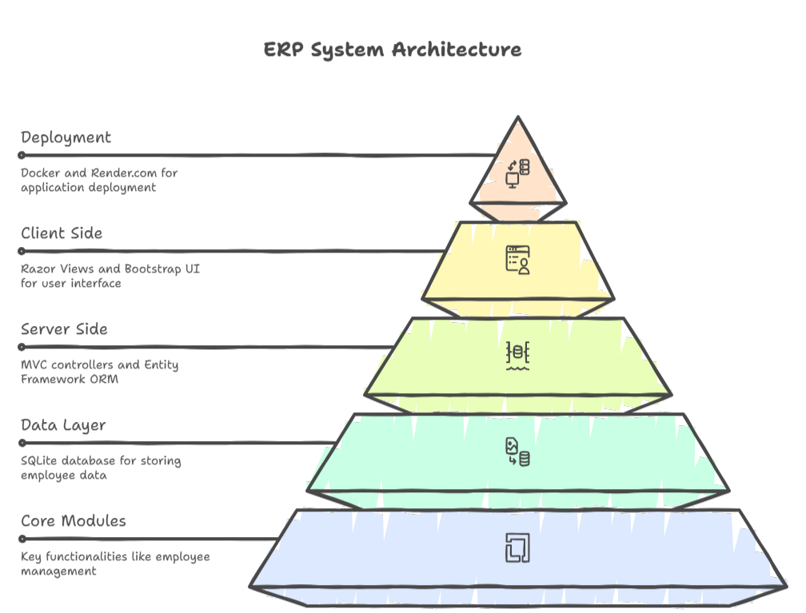

# ERP - Human Resources Management System

> **🚀 Live Demo:** Check out the application at [erp-y94u.onrender.com](https://erp-y94u.onrender.com/)

A comprehensive Enterprise Resource Planning (ERP) solution focused on Human Resources management. Built with modern .NET technologies, this application provides a complete suite of HR modules including employee management, recruitment, payroll, equipment tracking, and compensation management.

---

## 🛠️ Tech Stack

<p align="center">
  
  &nbsp;&nbsp;&nbsp;&nbsp;
  
  &nbsp;&nbsp;&nbsp;&nbsp;
  
  &nbsp;&nbsp;&nbsp;&nbsp;
  
  &nbsp;&nbsp;&nbsp;&nbsp;
  
</p>

**Backend**
- .NET 9.0 / ASP.NET Core MVC
- Entity Framework Core 9.0 (Code-First approach)
- SQLite for data persistence

**Frontend**
- Razor Views with Bootstrap 5
- jQuery for client-side interactions
- Bootstrap Icons

**Infrastructure**
- Docker containerization
- Render.com cloud deployment

---

## 🏗️ Architecture

<p align="center">
  
</p>

### Layer Breakdown

| Layer | Technology | Responsibility |
|-------|-----------|----------------|
| **Presentation** | Razor Views, Bootstrap 5, jQuery | User interface, form handling, client-side validation |
| **Controller** | ASP.NET Core MVC | Request routing, model binding, response generation |
| **Business Logic** | C# Services, Dependency Injection | Business rules, workflows, data validation |
| **Data Access** | Entity Framework Core 9.0 | ORM, migrations, query generation, change tracking |
| **Database** | SQLite | Data persistence, ACID transactions |

---

## ✨ Features

### 👥 Employee Management
Complete employee lifecycle management from hiring to departure:
- **Comprehensive Profiles** - Personal information, contact details, professional data
- **Contract Management** - Multiple contract types (CDI, CDD, Stage, Freelance)
- **Status Tracking** - Active, On Leave, Terminated with effective dates
- **Assignment History** - Track equipment, compensation packages, and positions
- **Department Organization** - Organize employees by poles/departments

### 📋 Recruitment Module
End-to-end recruitment workflow:
- **Job Offers** - Create and publish positions with detailed requirements
- **Candidate Database** - Centralized applicant information
- **Application Pipeline** - Track applications through stages (Submitted → Under Review → Interview → Decision)
- **Interview Management** - Schedule interviews, add notes, track feedback
- **Status Workflow** - Automated status updates and notifications

### 💰 Payroll System
Comprehensive salary and compensation management:
- **Salary Calculation** - Position-based base salary with automated calculations
- **Allowances (Indemnités)** - Housing, transport, meal allowances
- **Bonuses (Primes)** - Performance, project, seniority bonuses
- **Advantages (Avantages)** - Health insurance, gym memberships, training budgets
- **Payslip Generation** - Detailed salary breakdowns

### 🖥️ Equipment Management
Track and manage company assets:
- **Inventory System** - Computers, phones, furniture, vehicles, and more
- **Assignment Tracking** - Link equipment to employees with date ranges
- **Status Management** - Available, Assigned, Under Maintenance, Retired
- **Equipment History** - Full audit trail of assignments and returns
- **Category Organization** - Organize by equipment type

### 💼 Compensation Packages
Flexible employee benefit structures:
- **Package Templates** - Pre-configured benefit bundles
- **Custom Configurations** - Employee-specific customizations
- **Multiple Benefit Types** - Combine bonuses, allowances, and advantages
- **Historical Tracking** - Maintain compensation history

### 🏢 Position Management
Organizational structure and hierarchy:
- **Job Positions** - Define roles with base salaries
- **Departmental Structure** - Organize positions by department
- **Hierarchy Tracking** - Manager and reporting relationships

---

## 🚀 Getting Started

### Prerequisites

- [.NET 9.0 SDK](https://dotnet.microsoft.com/download/dotnet/9.0) or later
- [Git](https://git-scm.com/)
- (Optional) [Docker](https://www.docker.com/) for containerized deployment

### Installation

1. **Clone the repository**
   ```bash
   git clone https://github.com/your-username/ERP.git
   cd ERP
   ```

2. **Restore NuGet packages**
   ```bash
   dotnet restore
   ```

3. **Apply database migrations**
   ```bash
   dotnet ef database update
   ```
   This creates the SQLite database with all required tables and seed data.

4. **Run the application**
   ```bash
   dotnet run
   ```

5. **Access the application**
   - HTTPS: `https://localhost:5001`
   - HTTP: `http://localhost:5000`

### Development Mode

For hot-reload during development:
```bash
dotnet watch run
```

---

## 🗄️ Database Schema

The application uses **Entity Framework Core Code-First** approach with SQLite.

### Main Entities

- **Employe** - Employee master data
- **Contrat** - Employment contracts
- **Position** - Job positions with salary ranges
- **OffreEmploi** - Job offers
- **Candidat** - Candidate information
- **Candidature** - Job applications
- **Equipement** - Company equipment inventory
- **AssignationEquipement** - Equipment assignments
- **Paie** - Payroll records
- **Indemnite, Prime, Avantage** - Compensation components
- **CompensationPackage** - Benefit packages

### Relationships

- One Employee → Many Contracts
- One Position → Many Employees
- One Employee → Many Equipment Assignments
- One Offer → Many Applications
- One Employee → One Compensation Package

---

## 🔧 Configuration

### Database Connection

Located in `appsettings.json`:
```json
{
  "ConnectionStrings": {
    "DefaultConnection": "Data Source=erp.db"
  }
}
```

### Application Settings

```json
{
  "Logging": {
    "LogLevel": {
      "Default": "Information",
      "Microsoft.AspNetCore": "Warning"
    }
  },
  "AllowedHosts": "*"
}
```

---

## 🛠️ Common Tasks

### Database Migrations

```bash
# Create a new migration
dotnet ef migrations add MigrationName

# Apply all pending migrations
dotnet ef database update

# Rollback to a specific migration
dotnet ef database update PreviousMigrationName

# Remove last migration (if not applied)
dotnet ef migrations remove

# Generate SQL script
dotnet ef migrations script
```

### Building and Publishing

```bash
# Build in Debug mode
dotnet build

# Build in Release mode
dotnet build -c Release

# Publish for deployment
dotnet publish -c Release -o ./publish

# Run published application
cd publish
dotnet ERP.dll
```

### Running Tests

```bash
# Run all tests
dotnet test

# Run with coverage
dotnet test /p:CollectCoverage=true
```

---

## 🐳 Docker Deployment

### Using Docker

```bash
# Build Docker image
docker build -t erp-system .

# Run container
docker run -d -p 8080:8080 --name erp-app erp-system

# View logs
docker logs -f erp-app

# Stop container
docker stop erp-app
```

### Docker Compose

```yaml
version: '3.8'
services:
  erp:
    build: .
    ports:
      - "8080:8080"
    environment:
      - ASPNETCORE_ENVIRONMENT=Production
      - PORT=8080
    volumes:
      - erp-data:/app/data
volumes:
  erp-data:
```

Run with:
```bash
docker-compose up -d
```

---

## 🌐 Deployment to Render.com

The application is configured for deployment on Render.com:

1. **Dockerfile** is optimized for cloud deployment
2. **Environment Variables** are configured via Render dashboard
3. **SQLite database** is stored in persistent volume
4. **Port binding** uses `PORT` environment variable

**Live application:** https://erp-y94u.onrender.com/

### Environment Variables

| Variable | Description | Default |
|----------|-------------|---------|
| `ASPNETCORE_ENVIRONMENT` | Runtime environment | `Production` |
| `PORT` | Application port | `8080` |

---

## 🎯 Key Features Implementation

### Dependency Injection

Services are registered in `Program.cs`:
```csharp
builder.Services.AddScoped<IEmployeService, EmployeService>();
builder.Services.AddScoped<IRecrutementService, RecrutementService>();
```

### Repository Pattern

All data access goes through EF Core DbContext with service layer abstraction.

### View Models

Separate view models for create/edit operations to avoid over-posting attacks:
```csharp
public class CreateEmployeViewModel
{
    [Required]
    public string Nom { get; set; }
    // ... other properties
}
```

### Validation

Server-side validation with Data Annotations:
- `[Required]`
- `[StringLength]`
- `[EmailAddress]`
- `[DataType]`
- Custom validation attributes

---

## 📊 Code Quality

### Architecture Patterns

- **MVC Pattern** - Clear separation of concerns
- **Repository Pattern** - Data access abstraction via services
- **Dependency Injection** - Loose coupling and testability
- **ViewModel Pattern** - Secure data binding

### Best Practices

- ✅ Entity Framework migrations for version control
- ✅ Async/await for database operations
- ✅ Model validation with Data Annotations
- ✅ Service layer for business logic
- ✅ CSRF protection enabled
- ✅ SQL injection prevention via parameterized queries

---

## 🔐 Security

- **Anti-Forgery Tokens** - CSRF protection on all forms
- **Data Validation** - Server-side validation on all inputs
- **SQL Injection Prevention** - EF Core parameterized queries
- **XSS Protection** - Razor automatic encoding
- **HTTPS Enforcement** - Redirect HTTP to HTTPS in production

---

## 🤝 Contributing

Contributions are welcome! Please follow these steps:

1. Fork the repository
2. Create a feature branch: `git checkout -b feature/AmazingFeature`
3. Commit your changes: `git commit -m 'Add some AmazingFeature'`
4. Push to the branch: `git push origin feature/AmazingFeature`
5. Open a Pull Request

### Code Style

- Follow C# naming conventions (PascalCase for public members)
- Use async/await for database operations
- Add XML documentation comments for public APIs
- Keep controllers thin - business logic belongs in services

---

## 📝 License

This project is developed for educational and demonstration purposes.

---

## 🙏 Acknowledgments

- Built with ❤️ using .NET 9.0
- UI powered by Bootstrap 5
- Icons from Bootstrap Icons
- Deployed on Render.com

---

<p align="center">
  <strong>Made with .NET 9.0</strong>
</p>